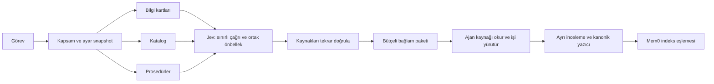

# Hafıza OS mimarisi ve paralel çalışma

Veri sahipliği [kayıt sözleşmesinde](zihin/hafıza-sistemi.md) tanımlıdır. Jev dar anlamsal
kararlar verir. Dosya/kayıt uygunluğu, kaynak sürümü, izin ve yazma kodla
kontrol edilir. Jev sonucu kullanıcı kabulü veya kalıcı kayıt değildir.

## Çalışan sözleşme

- Bilgi, katalog ve prosedür okuyucuları en fazla üç iş parçacığında çalışır;
  son paket tek akışta, sabit öncelik ve karakter bütçesiyle birleştirilir.
- Bir pakette tek Jev ayar snapshot'ı ve ortak inference son zamanı kullanılır.
  Varsayılan üç saniye; yerel dosya okuma/işleme süresi bu sınırın dışındadır.
  Ayar değişikliği sonraki pakette geçerlidir. Gizli/yerel-only çağrılarda
  görev bağlamına ait kapatma bayrağı bütün model amaçlarını kapsar;
  modül fonksiyonları geçici olarak değiştirilmez.
- Aynı sorgu, aday, kapsam, kaynak sürümü, rubrik ve sağlayıcı isteği aynı
  fingerprint'e sahiptir. Yerel süreçler aynı kilidi paylaşır; ilk geçerli
  sonuç atomik önbelleğe yazıldıktan sonra bekleyenler onu yeniden kontrol eder.
- Kasa başına en fazla üç yerel sağlayıcı işi aynı anda çalışır. 256 hash
  kilidi ve üç kapasite kilidi kalıcı dosyalardır; silinmez. Hash çakışması
  nadiren ilgisiz istekleri sıraya sokabilir. Aynı süreç en fazla 16 çalışan
  veya bekleyen koordinasyon işi kabul eder; fazlası yerel geri dönüşe gider.
- Kilit/kuyruk beklemesi inference süresine dahildir. Timeout alan çağrı
  otomatik tekrarlanmaz. Devam eden transport bitene kadar kendi kapasite
  yerini tutar; geç gelen yanıt teslim edilmiş geri dönüşü değiştiremez.
- Bu sınır canlı yerel süreçlerin transport işleri içindir. Süreç öldüğünde
  işletim sistemi kilidi bırakır; sağlayıcıda başlamış isteğin iptal veya
  ücretlendirilmemiş olduğu garanti edilmez. Yerel dosya kilidi farklı
  makineleri koordine etmez. Ağ/Obsidian sync dizini dağıtık kilit değildir.
- Kaynak alıntısı ve hash aynı baytlardan doğrulanır. Kart içeriği ile sürüm
  eşleşmeden değerlendirme yapılmaz; birleştirmede aynı yolun farklı sürümleri
  sessizce birbirini ezmez. Kaynak ve merkezi kayıt sürümleri paket sonunda kontrol edilir. Değişiklik
  varsa türetilmiş paket boşaltılır ve yeniden doğrulama bildirimi verilir.
  Bu bir dosya sistemi transaction'ı değildir; önemli işlemden hemen önce
  kaynağı yeniden doğrulama kuralı sürer.
- Codex hook state kilidi oturum başınadır; farklı oturumlar ağ beklerken
  birbirini durdurmaz. Aynı oturum sıralaması korunur. Paylaşılan makbuz
  indeksi ve kanonik yazıcı ayrı kilitlere sahiptir.
- Aday incelemesinde bekleyenlik kontrolü, terfi ve terminal karar tek yazıcı
  kilidindedir. Reddedilmiş/tekrar sayılmış/terfi edilmiş aday yeniden terfi
  edemez. Atomik dosya değiştirme tek başına okuma-değiştirme-yazma güvenliği
  sağlamaz; yazıcı kilidi ayrıca gerekir.
- Paket kimliği ve tekrar bastırma; metin, kaynak sürümü ve teslim seçimine
  dayanır. Model gecikmesi, cache hit veya token sayacı kimliği değiştirmez.

## Bilinen sınırlar

Mem0 sync ayrı bir senkron kilidinde çalışır. Kısa kanonik kilitte katalog
snapshot'ı ve işlem niyeti hazırlanır; ağ sırasında kanonik kilit tutulmaz.
Sonunda katalog aynıysa uzak kimlik bağları tek yazmayla uygulanır. Katalog
arada değişmişse eski kopya yazılmaz, `catalog_conflict` ve
`reconciliation_required` döner; doğrulanmış sayısı sıfırlanır.
`günlük/hafıza-makbuzları/sync-transactions/` işlem durumlarını tutar.

Ağ sonucu belirsizse işlem `remote_outcome_unknown` kalır. Yeniden senkron
uzak metadata'daki kanonik kimlikten kaydı bulabilir; otomatik tekrar yoktur.
Bu iki aşamalı uzlaştırma uzak işlemi transaction'a dönüştürmez: çatışma veya
çökmede Mem0 geçici olarak eski sürümde kalabilir. Yerel kanonik kaynak
üstündür; indeks onarımı sonraki açık sync işlemidir. Tam otomatik outbox
kuyruğu/yeniden deneme servisi kurulmaz.

Karakter/aday/soru limitleri günlük para limiti değildir. Timeout ücretlenebilir.
Sağlayıcı maliyet üst sınırı ayrıca yönetilir. 32 aday sınırını aşan havuzda
sessizce daha çok istek üretilmez; mevcut kontrollü geri dönüş korunur.

Sağlayıcı olasılıkları varsa score ile ağırlıklı ortalaması da doğrulanır;
Vercel yuvarlama aralıkları korunur. Eski normalize cache kayıtları için
olasılıksız score desteği sürer; tam ağ şeması migration ayrı iştir.

Model confidence arayüzü doğruluğu, kanıt yeterliliği veya izin değildir.
`assist` kaynak adayı sunar; `on` tek seçici kullanımına geçmek ayrı kalite
ölçümü gerektirir. Paralellik bir kalite artışı veya token tasarrufu iddiası değildir.

## Önerilen deneyler — henüz etkin değil

1. **Tek değerlendirmede çok soru:** Aynı görevin izinli adaylarını ayrı alanlarda
   taşıyıp üç amaç sorusunu bir çağrıda toplamak. Amaçların kanıt/kapsam sınırını
   koru. Deney: üç çağrı ile aynı dondurulmuş sorularda erişim, yanlış aday,
   token ve P95 karşılaştır. Büyük state veya tek hata bütün yüzeyleri bozarsa
   birleştirme başarısız sayılır.
2. **Görev çatışması danışmanı:** Kod her görevin okuyacağı/yazacağı dosyaları
   belirler. Jev yalnız belirsiz iş tariflerini bilinen kaynaklara eşler;
   aynı dosyaya yazma çatışmasını kod hesaplar. Önce gölge modunda insanın
   bildiği çatışmalarla ölç. Modelin kaçırdığı çatışma paralellik izni üretmez.
3. **Kanıt borcu listesi:** Cevaptaki iddiaları kaynak desteği, eksik kanıt ve
   çelişki olarak ayrı puanla. Eksik kanıt için en fazla bir ek kaynak okuma;
   belirsizlikte güçlü modele/insana geç. Deney: yanlış kullanıcı tercihi
   atfı ve gereksiz ek okuma sayısını birlikte ölç.
4. **İş başına model bütçesi:** Basit kesin yerel eşleşmede sıfır inference;
   belirsiz dar seçimde Jev; çözülemeyen çok adımlı gerekçede güçlü model.
   Bütçeyi kod koyar. Jev'in kendisine ihtiyaç olduğuna karar vermesi için
   her görevde fazladan çağrı yapmak tasarruf varsayılmaz.
5. **Koşula bağlı prosedür hafızası:** Kaynaklı başarılı/başarısız uygulama
   örneklerini prosedür seçiminde kullan. Jev yalnız koşul benzerliğini puanlar.
   Deney: servis kesintisini yanlış prosedür gibi yorumlayıp iyi yolu bastırıyor
   mu? Tek bir son başarısızlığa aşırı tepki veriyorsa özelliği bırak.

Bunlar mimari hipotezlerdir. Kullanıcı faydası veya uygulanmış özellik sayılmaz.

## Kaynaklar

- [TypeSafe API](https://docs.typesafe.ai/api.md): state ve bağımsız typed questions.
- [TypeSafe fan-out](https://docs.typesafe.ai/patterns/fan-out.md): aynı state üzerinde bağımsız soruları birlikte sorma.
- [Python contextvars](https://docs.python.org/3/library/contextvars.html): görev bağlamını ayrı taşıma.
- [Python futures](https://docs.python.org/3/library/concurrent.futures.html): paralel yürütme ve iptal sınırları.

Teknik doğrulama: `python3 -m unittest discover -s araclar -p 'test_*.py'`.
Özel paralellik testleri `test_jev_concurrency.py` içindedir; sahte transport,
ayrı süreç, timeout, son kaynak kontrolü ve iki inceleyici yarışı içerir.
